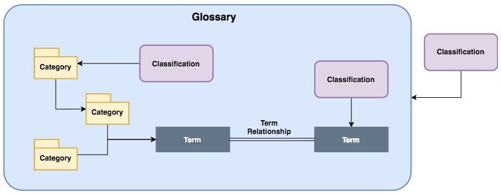
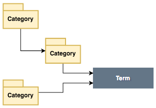
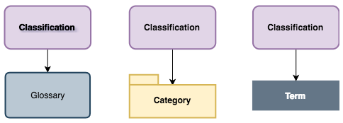

<!-- SPDX-License-Identifier: CC-BY-4.0 -->
<!-- Copyright Contributors to the ODPi Data Governance project. -->

# Anatomy of a glossary

A glossary is a collection of common data definitions, typically focused on defining the meaning of data.
An organization may have multiple glossaries that represent different collections of definitions, each reflecting a scope
of use or a source of the definitions.

Each glossary defined should have a well defined content and an owner, who is responsible for ensuring that the contributed
content meets the needs of its consumers.

Figure 1 shows the typical content of a glossary.

> Figure 1: Elements within a glossary

The glossary terms describe a single concept.  The glossary categories are like folders to organize the glossary terms.
Glossary terms that are related to one another can be linked together with term relationships.
There are different types of term relationships that help to pin down how the glossary terms are related.
Finally there are classifications that can be linked to the glossary itself, the glossary categories or the glossary terms.
The classification provide more information about the kind of element it is connected to, or its intended use.

The sections that follow provide more information about these concepts and how they are used.
There is further information on how to define a glossary in the [Coco Pharmaceuticals scenarios](../coco-pharmaceuticals/scenarios/defining-a-glossary/README.md).

## Inside a glossary term

At a minimum glossary term has a name - this is the concept it describes, and a short description that explains at a high level what this concept means.   This short description should distinguish it from other terms.

For some glossaries, this may be all that you need.  However, if this is an important term and the consumers of it
will want to know much more, then the glossary term can be built out to include a more detailed description and supplementary information such as:

* links to further information
* images of the concept
* descriptions of its usage
* examples of its use.

> Figure 2: Contents of a glossary term

The glossary term may then be organized into one or more categories, classified and linked to related terms.

## Glossary categories

Glossary categories provide a folder structure for organizing glossary terms.  A category belongs to a single glossary
but it may contain glossary terms both from its local glossary and other glossaries.  Categories can also be
nested inside a single parent to create a folder structure.

> Figure 3: Glossary categories

## Glossary term relationships

Glossary terms can be linked together in pairs to show that they are related in some way.

> Figure 4: Glossary term relationships

The relationships between glossary terms are divided into two groups:
* Relationships that show how the meanings of terms are related.  This includes:
  * **RelatedTerm** is a relationship used to say that the linked glossary term may also be of interest. It is like a "see also" link in a dictionary.
  * **Synonym** is a relationship between glossary terms that have the same, or a very similar meaning.
  * **Antonym** is a relationship between glossary terms that have the opposite (or near opposite) meaning.
  * **PreferredTerm** is a relationship that indicates that one term should be used in place of the other term linked by the relationship.
  * **ReplacementTerm** is a relationship that indicates that one term must be used instead of the other. This is stronger version of the PreferredTerm.
  * **Translation** is a relationship that defines that the linked terms represent the same meaning but each are written in a different language. Hence one is a translation of the other. The language of each term is defined in the Glossary that owns the term.
  * **IsA** is a relationship that defines that the one term is a more generic term than the other term. For example, this relationship would be use to say that "Cat" IsA "Animal".
* Relationships that show how terms are typically used together.
  * **UsedInContext** links a term to another term that describes a context.  This helps to distinguish between
terms that have the same name but different meanings depending on the context.
  * **HasA** is a term relationship between a term representing a **SpineObject** (see glossary term classifications below) and a term representing a **SpineAttribute**.
  * **IsATypeOf** is a term relationship between two SpineObjects saying that one is the sybtype (specialisation) of the other.
  * **TypedBy** is a term relationship between a SpineAttribute and a SpineObject to say that the SpineAttribute is implemented using a type represented by the SpineObject.

## Glossary classifications

The contents of a glossary can be further described using classifications.
These are descriptions that tell the consumer more about how the glossary is defines and used.

> Figure 5: Glossary classifications

There are different types of classifications for the glossary itself, each glossary category and each glossary term.

### Classifications for a glossary

A glossary may be classified to describe the way its content should be used.

* **Taxomony** means that the same term is not present in more than one of its categories.  This is used in glossaries that are designed to provide an organizing structure for other types of informaiton, such as a document library.

* **Canonical Vocabulary** means the glossary only includes terms that have a unique name.  Thus there is only one
defnition for any concept.

### Classifications for a category

* **Subject Area** means the category describes an important topic area for the organization.
Typically subject areas have owners and are managed carefully.
To understand more about subject areas and how they are used see the [Coco Pharmaceuticals scenarios](../docs/coco-pharmaceuticals/scenarios/defining-subject-areas/README.md).

### Classifications for a term

* **ActivityDescription** is a classification used to indicate that the term describes a verb, or an activity. Most term definitions are nouns, they describe concepts or things. However, it is useful to be able to define the meanings of particular activities in the glossary. The ActivityDescription classification highlights when a term describes such an activity.  This classification can be further refined with a specific activity type:

  * OPERATION - describes a function or API call
  * ACTION - describes a governance action that results from evaluating governance rules.
  * TASK - describes a task performed by a person.
  * PROCESS - describes a process, which is a series of steps that are performed in a defined order.
  * PROJECT - describes a type of project.
  * OTHER - describes some other type of activity
  
* **AbstractConcept** means that the term describes an abstract concept.
* **DataValue** means that the glossary term describes a valid value for a data item.
* **ContextDefinition** indicates that the term describes a context.  Contexts define where a specific definition
is used.
* **SpineObject** indicates that the term represents a type of object (such as a person, place, thing).
* **SpineAttribute** indicates that the term represents a type of attribute or data field.
* **ObjectIdentifier** indicates that a term is typically is a type of attribute or data field that is an identifier for an object.

## Further information
* [Defining a glossary scenario](../coco-pharmaceuticals/scenarios/defining-a-glossary/README.md)
* [Open metadata types for a glossary](https://github.com/odpi/egeria/blob/master/open-metadata-publication/website/open-metadata-types/Area-3-models.md)
* [Subject Area OMAS API for defining and storing information](https://github.com/odpi/egeria/blob/master/open-metadata-implementation/access-services/subject-area/README.md)
----
License: [CC BY 4.0](https://creativecommons.org/licenses/by/4.0/),
Copyright Contributors to the ODPi Data Governance project.
