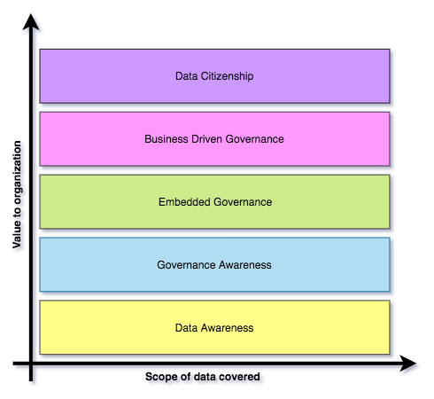
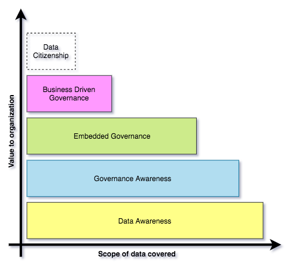

<!-- SPDX-License-Identifier: CC-BY-4.0 -->
<!-- Copyright Contributors to the ODPi Egeria project. -->

# Governance Maturity Model

The data governance maturity model shown in Figure 1 was first published in 2018:

> REDP5486 The Journey Continues: from Data Lake to Data-Driven Organization
> [http://www.redbooks.ibm.com/abstracts/redp5486.html?Open](http://www.redbooks.ibm.com/abstracts/redp5486.html?Open)

> **Figure 1:** Governance Maturity Model

It shows five levels of maturity that build on one another until the organization is able to support
a wide range of advanced data use along with appropriate self-service
access to data for a majority of people in the organization.
This is the capability that Forrester calls 
[Data Citizenship](https://www.forrester.com/webinar/Data+Governance+20+The+Journey+Toward+Data+Citizenship/-/E-WEB21683).

In general, organizations are not universally at one level of maturity.
They adjust their investment to focus on the types of data that will bring the most value.  So their coverage
looks more like figure 2.

> **Figure 2:** Staging maturity

The maturity levels are:

* **[Data Awareness](Data-Awareness.md)** - where is the organization's data and what does it contain?
* **[Governance Awareness](Governance-Awareness.md)** - how should data be governed?
* **[Emdedded Governance](Embedded-Governance.md)** - how can governance be automated?
* **[Business Driven Governance](Business-Driven-Governance.md)** - how can the business leaders take ownership of data and governance?
* **[Data Citizenship](Data-Citizenship.md)** - how can every employee, system and server get the data they need, every day?

Click on the links above for more detail about each level.
You will notice that the number of integrations between tools,
engines and metadata repositories grows with each level of maturity.
[ODPi Egeria](https://egeria.odpi.org/)
provides open standards and services to simplify this integration.

----
License: [CC BY 4.0](https://creativecommons.org/licenses/by/4.0/),
Copyright Contributors to the ODPi Egeria project.
