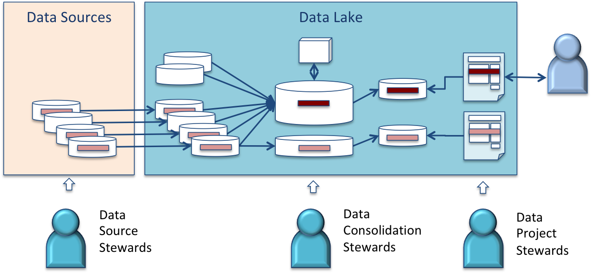

<!-- SPDX-License-Identifier: CC-BY-4.0 -->
<!-- Copyright Contributors to the ODPi Egeria project. -->

# Data Governance Roles

Data governance defines how an organization will make best use of data whilst also
keeping it safe and managed with a reasonable level of cost and resources.
Done well, data governance creates a sense of responsibility for data across every
person in an organization plus an appreciation of its value to their work.

Of course, not everyone is responsible for everything.  An individual will
have different skills and interests.  Therefore data governance breaks down the
work that needs to happen into tasks and groups related tasks into what are called
roles.

A role is assigned to a person with a scope.  This makes them responsible for
performing the tasks for the role, within the assigned scope.

The scope defines the specific
data sets and/or processing that this person must perform the tasks for.

For example, the data stewardship
role lists all of the tasks related to making a data set fit for purpose, such
as correcting errors in it.
There may be a data steward assigned to customer records, another for supplier
records and another for the financial accounts.

Where data is flowing from system to system, responsibility may be handed
off from one data steward to another as the data moves between their scopes of
responsibility.

Except in very large enterprises, the data governance roles are typically assigned
to individuals in addition to their main role in the organization.
Some of these roles are permanently assigned, and other may just be for a
project or particular incident.

Roles typically are clustered together defining related types of interactions
that need to occur.  The roles below are those most important to data
governance.  In some larger organizations, these roles may be staffed by a dedicated
team, or further sub-divided into more specific roles.  However, for most
organizations, they represent just part of an individual's responsibility.

## Organizational Leadership (general)

Roles that lead in an organization:

* [Manager](manager-role.md)
* [Executive](executive-role.md)

## External Parties

Roles that interact with the organization:

* [Supplier](supplier-role.md)
* [Customer](customer-role.md)
* [Regulator](regulator-role.md)

## Governance Leadership roles

Roles that occur when governance programs are in place:

* [Data Officer](data-officer-role.md)
* [Security Officer](security-officer-role.md)
* [Incident Owner](incident-owner-role.md)
* [Subject Area Owner](subject-area-owner-role.md)

## Data Privacy

Roles that lead in data privacy discussions:

* [Privacy Officer](privacy-officer-role.md)
* [Data Subject](data-subject-role.md)

## Data (and related Asset) Management

Roles involved in the day-to-day use of data (and related) assets:

* [Asset Owner](asset-owner-role.md)
* [Asset Consumer](asset-consumer-role.md)
* [Data Steward](data-steward-role.md)
* [Data Custodian](data-custodian-role.md)

## Digital Services

Roles for building and using digital services:

* [Advocate](advocate-role.md)
* [Architect](architect-role.md)
* [Project Lead](project-lead-role.md)
* [Developer](developer-role.md)
* [Systems Administrator](systems-administrator-role.md)

----
License: [CC BY 4.0](https://creativecommons.org/licenses/by/4.0/),
Copyright Contributors to the ODPi Egeria project.